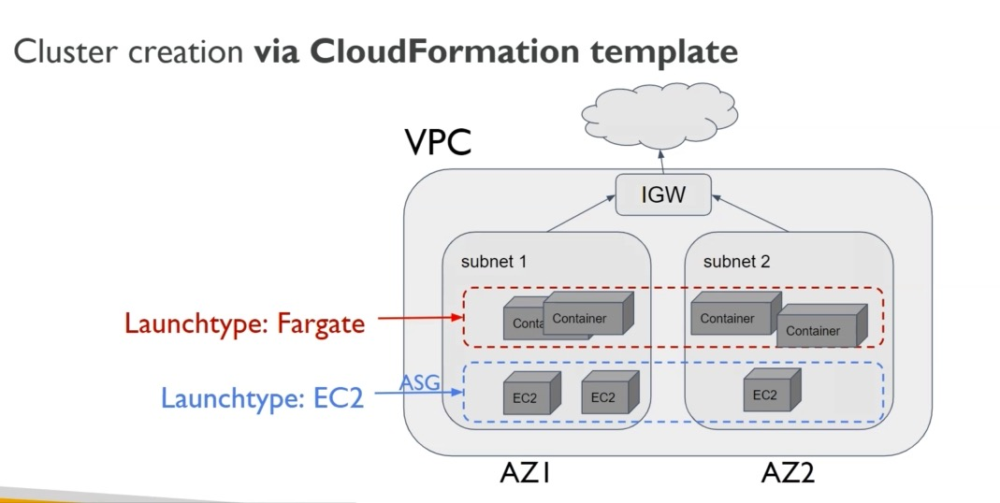
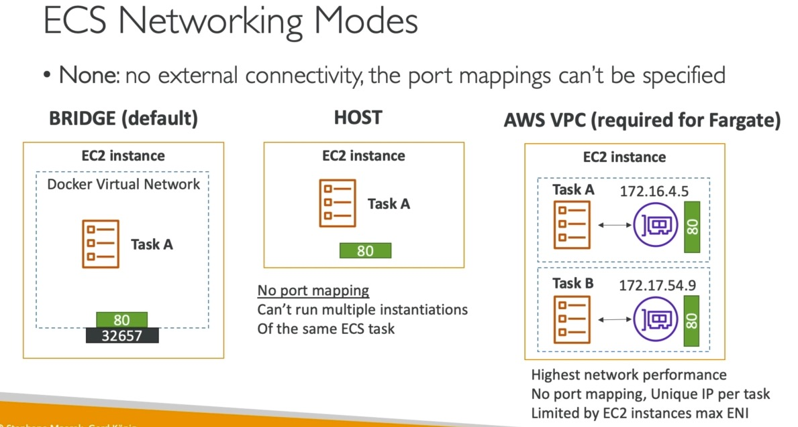

# Create ECS cluster based on EC2






AWS::EC2::Image for ECS
```
  ECSAMI:
    Description: AMI ID
    Type: AWS::SSM::Parameter::Value<AWS::EC2::Image::Id>
    Default: /aws/service/ecs/optimized-ami/amazon-linux-2/recommended/image_id
    Description: The Amazon Machine Image ID used for the cluster, leave it as the default value to get the latest AMI

```


Command to apply the CloudFormation template

Launchtype _EC2_:  

```bash
aws cloudformation create-stack --stack-name ecs-ec2 --capabilities CAPABILITY_IAM --template-body file://./ecs-ec2-via-cloudformation.yml
```

Launchtype _Fargate_:  

```bash
aws cloudformation create-stack --stack-name ecs-fargate --capabilities CAPABILITY_IAM --template-body file://./ecs-fargate-via-cloudformation.yml
```
