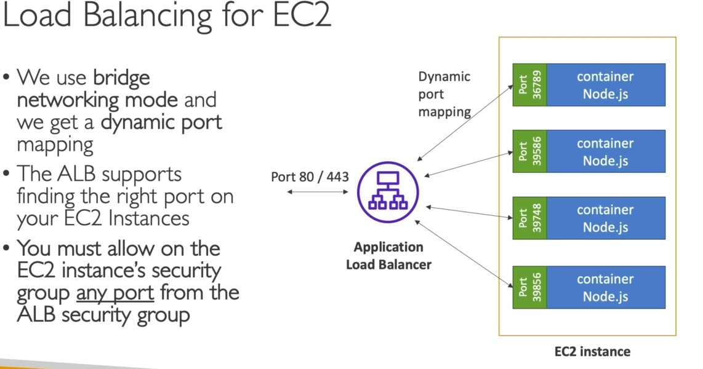
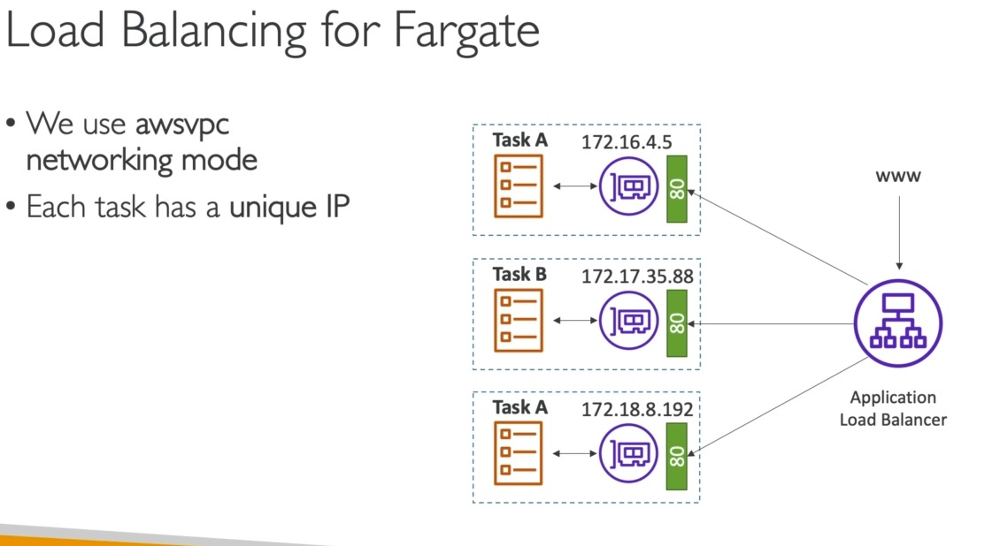
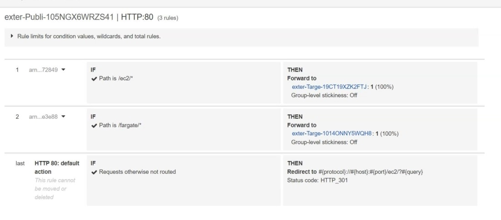

# Setup ALB
One ALB shall distribute traffic for both service types, EC2 and Fargate.  
For that we configure a _path-based_ routing within ALB to forward traffic with
* /ec2/* to service _ec2_




* /fargate/* to service _fargate_




## Create ALB, via Cloudformation template:

```bash
aws cloudformation create-stack \
--stack-name external-alb \
--template-body file://./alb-external.yml
```



## Create Fargate based service

* new service "simplehttp-fargate-service"
* based on task definition td-simplehttp
* enable loadbalancing
* check that securitygroup only allows traffic from ALB

## Create EC2 based service

* new service "simplehttp-ec2-service"
* based on task definition td-simplehttp-ec2
* enable loadbalancing
* check that securitygroup only allows traffic from ALB

## Test

Grab public DNS of the ALB and call

* \<public-alb-dns\>/fargate/ => reload multiplel times and check response property "local IP"
* \<public-alb-dns\>/ec2/ => reload multiplel times and check response property "local IP"
