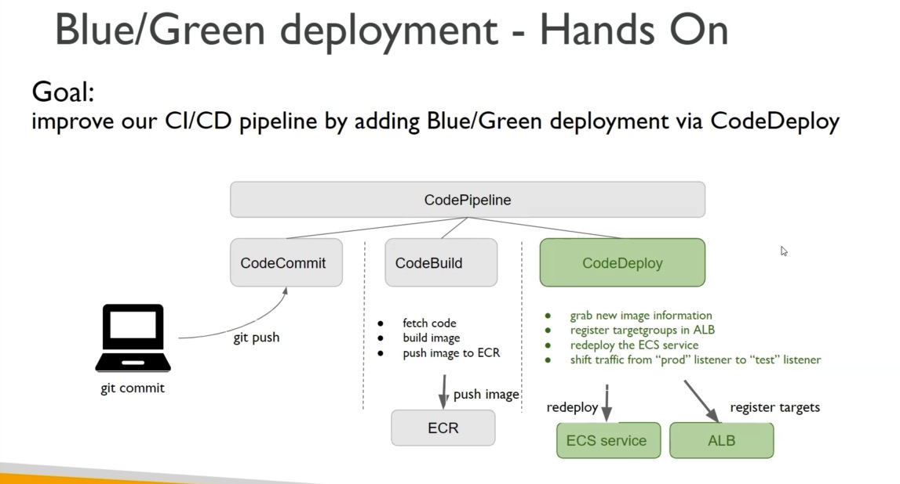
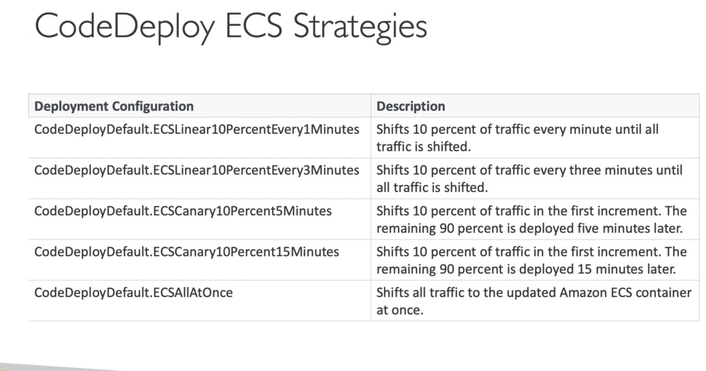

# Blue/Green deplyoment

## create IAM role

* in the main navigation choose _Roles_
* click _create Role_
* choose **CodeDeploy** as AWS service
* choose **CodeDeploy - ECS** as UseCase to add and click _Next::Permissions_
* ensure that on _attach permissions policies_ page the policy **AWSCodeDeployRoleForECS** is listed, otherwise add this policy
* click _Next:Tags_
* click _Next:Review_
* save the role as **CodeDeployServiceRole**





## extend Loadbalancer listeners

Open AWS mgm console, sectin _EC2_ ==> _Loadbalancer_
create two new listeners, one with port **8080** and one with port **8088** , for testing 

## create ECS service

create new service _simplehttp-bluegreen_

* EC2 based
* task definition _td-simplehttp-ec2_
* deployment type _Blue/green deployment (powered by AWS CodeDeploy)_
  * deployment config: Canary10Percent5Minutes
  * service role: CodeDeployServiceRole (the one which you created in the first step)
* Task placement: binpack
* disable _service discovery_
* enable Loadbalancing
  * choose existing loadbalancer
  * container to load balance: _simplehttp-container:0:8000 ==> click _Add to load balancer_
  * production listener port: 8080
  * enable _Test listener_
  * Test listener port: 8088
  * additional configuration ==> create two targetgroups: **bluegreen-1** and **bluegreen-2**

==> check CodeDeploy section in DeveloperTools category within AWS mgm console

## update CodePipeline

* Open your CodePipeline pipeline
  * update the _Build_ step
    * add missing artifacts to buildspec.yaml. Open buildspec.yml and replace the the existing _artifacts_ section by the following:

                  - printf '{"ImageURI":"%s"}' $REPOSITORY_URI:$IMAGE_TAG > imageDetail.json
            artifacts:
              files:
                - 'image*.json'
                - 'appspec.yaml'
                - 'taskdef.json'
              secondary-artifacts:
                DefinitionArtifact:
                  files:
                    - appspec.yaml
                    - taskdef.json
                ImageArtifact:
                  files:
                    - imageDetail.json

    * set output artifacts to _DefinitionArtifact_ and _ImageArtifact_ as listed in the buildspec.yml
  * update the _Deploy_ step 
    * change from _Deploy to ECS_ to use _Deploy to ECS (Blue/Green)_ as "Action provider"
    * choose the correct region your ECS is up and running
    * as "Input Artifacts" choose _ImageArtifact_ and _DefinitionArtifact_ (which are created at the build step, ref buildspec.yml )
    * Select the app and deployment group which have been created in the previous step (ECS service creation)
    * at "Amazon ECS task definition" choose _DefinitionArtifact_ and enter filename _taskdef.json_
    * at "AWS CodeDeploy AppSpec file" choose _DefinitionArtifact_ and enter filename _appspec.yaml_
    * enable "Dynamically update task definition image"
      * choose _ImageArtifact_ as Input artifact
      * enter _IMAGE1\_NAME_ as Placeholder text in the task definition
    * click _Done_

* add appspec.yaml to CodeCommit repository (in root directory)

```bash
version: 0.0
 
Resources:
  - TargetService:
      Type: AWS::ECS::Service
      Properties:
        TaskDefinition: <TASK_DEFINITION>
        LoadBalancerInfo:
          ContainerName: "simplehttp-container"
          ContainerPort: 8000
```

* add taskdef.json to CodeCommit repository
  * grab content from the task definition _td-simplehttp-ec2_ within ECS section, tab _JSON_ directly
  * property **image:** ==> replace the image name by the placeholder <IMAGE1_NAME> , including brackets
  * save file as taskdef.json add push it to _simplehttp_ CodeCommit repository

## trigger the pipeline

* edit simplehttp.go and change the output
* commit and push to CodeCommit
* CodePipeline will be triggered