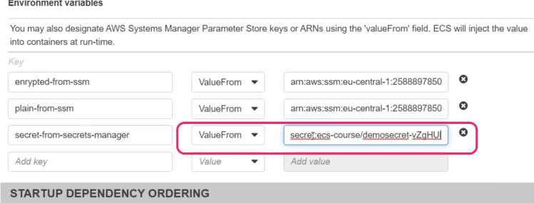
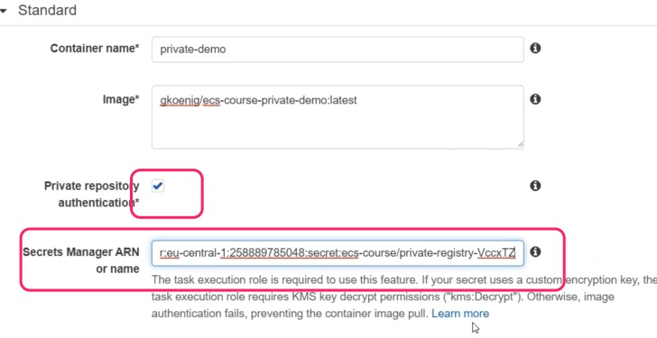
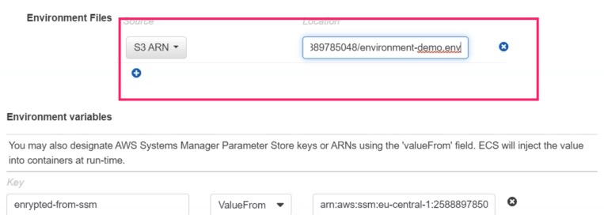
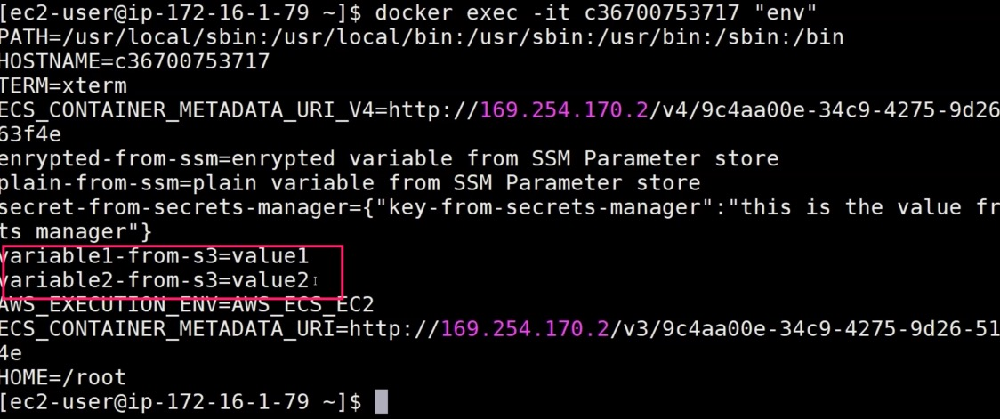

# Passing environment variables


AWS::EC2::Image for ECS
```
  ECSAMI:
    Description: AMI ID
    Type: AWS::SSM::Parameter::Value<AWS::EC2::Image::Id>
    Default: /aws/service/ecs/optimized-ami/amazon-linux-2/recommended/image_id
    Description: The Amazon Machine Image ID used for the cluster, leave it as the default value to get the latest AMI

```

## Options to pass vars to ECS container


## General
To be able to get properties from either SSM or Secrets mgr, the _taskexecution_ IAM role needs additional permissions. See https://docs.aws.amazon.com/AmazonECS/latest/developerguide/task_execution_IAM_role.html for all details.  

* Go to _IAM_ in AWS mgm console
* click on _Roles_
* click _ecsTaskExecutionRole_
* click _Add inline policy_
* open _JSON_ tab, and paste the following:  

```
{
  "Version": "2012-10-17",
  "Statement": [
    {
      "Effect": "Allow",
      "Action": [
        "secretsmanager:GetSecretValue",
        "ssm:GetParameters",
        "kms:Decrypt"
      ],
      "Resource": [
        "arn:aws:secretsmanager:eu-central-1:##youraccount-id##:secret:*",
        "arn:aws:ssm:eu-central-1:##youraccount-id##:parameter/*",
        "arn:aws:kms:eu-central-1:##youraccount-id##:*"
      ]
    },
    {
      "Effect": "Allow",
      "Action": [
        "s3:GetObject"
      ],
      "Resource": [
        "arn:aws:s3:::ecs-course-##youraccount-id##/environment-demo.env"
      ]
    },
    {
      "Effect": "Allow",
      "Action": [
        "s3:GetBucketLocation"
      ],
      "Resource": [
        "arn:aws:s3:::ecs-course-##youraccount-id##"
      ]
    }
  ]
}
```

* provide a name for this policy : "ecs-course-parameter-source"


Let's also create a dedicated ECS service and task definition for this demo scenario. For that we use a plain Ubuntu image.

* within section "ECS" in AWS mgm console
* click _Task definition_
* click _Create new task definition_
* select _EC2_, click _Next_
* enter as name **td-plain-ubuntu**
* select _task execution role_ properly to our recently created one
* click _Add container_
* container name: _plain-ubuntu_
* image: _ubuntu:latest_
* Memory limit: _128_
* entrypoint: _sleep,infinity_

* go to _ECS clusters_ overview
* click _Create_ in tab _Services_ to create a new service
* name: _plain-ubuntu_
* select previously created task definition
* _Create_ , no further modification required

## SSM Parameter Store


Open AWS mgm console and navigate to AWS Systems Manager
* click on _Parameter Store_
* click _Create Parameter_
* provide name: plain-variable-from-ssm
* Type: String
* Value: plain variable from SSM Parameter store
* click _Create parameter_

* click _Create parameter_
* provide name: enrypted-variable-from-ssm
* Type **SecureString**
* use default KMS store _My current account_
* Value: encrypted variable from SSM Parameter store

check parameter:

```bash
aws ssm get-parameter --name plain-variable-from-ssm
```

Now update the container definition within our task definition, to provide both parameters to the container.
Open section _Environment variables_ and provide _name_ as "plain-from-ssm" & drop-down-box value _ValueFrom_ and in the value textbox, enter the ARN of the corresponding parameter (the ARN you grab with _aws ssm get-parameter_ as shown above)

After updating the task definition, redeploy the _plain-Ubuntu_ service , followed by ssh to the EC2 box and check the env inside the Ubuntu docker container.

```
docker exec -it <container_name> "env"

```


## Secrets manager




## Connecting to a private docker repository

https://docs.aws.amazon.com/AmazonECS/latest/developerguide/private-auth-container-instances.html  
https://docs.aws.amazon.com/AmazonECS/latest/developerguide/private-auth.html

Use Secrets manager to specify your username & password for your DockerHub account.

* Open the AWS Secrets Manager console at https://console.aws.amazon.com/secretsmanager/.
* Choose Store a new secret.
* For Select secret type, choose Other type of secrets.
* Select Plaintext and enter your private registry credentials using the following format:

```
{
  "username" : "<<your-username>>",
  "password" : "<<passwd-or-access-key>>"
}
```

* Choose _Next_
* For Secret name, type an optional path and name, such as production/MyAwesomeAppSecret or development/TestSecret, and choose _Next_
* Review and _Save_
* click on the secret and copy the **ARN**




* create new task definition
* launchtype _EC2_
* name: _td-private-repo-demo_
* add container
  * _Image_ : gkoenig/ecs-course-private-demo:1.0
  * mark the checkbox _Private repository authentication_
  * Secrets Manager ARN: **provide the ARN of the secret which you created in the previous step**
* click _Create_

* start simply a manual task, based on the above task definition _td-private-repo-demo_
* open public URL to show the added text output


## File from S3
This functionality is limited to **EC2 based tasks/services only** !!



### create env file and upload to S3

```
ACCOUNTID=$(aws sts get-caller-identity | awk '{print $1}')
aws s3 mb s3://ecs-course-$ACCOUNTID
echo "variable1-from-s3=value1" > environment-demo.env
echo "variable2-from-s3=value2" >> environment-demo.env
aws s3 cp ./environment-demo.env s3://ecs-course-$ACCOUNTID/
```

### add env file to task definition

* open (EC2 based) task definition
* open _Container definition_
* in section _Environment Files_ click on "+" sign
* provide full S3 ARN to the recently uploaded .env file
  _arn:aws:s3:::ecs-course-$ACCOUNTID/environment-demo.env_

