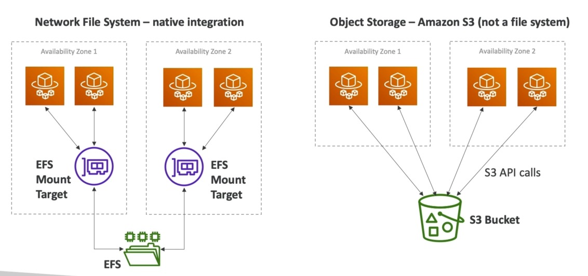
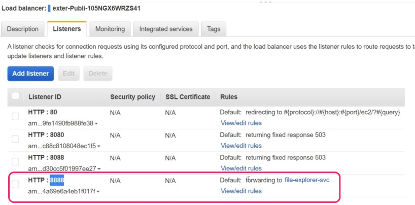

## EBS Vs. EFS





# EFS integration

https://aws.amazon.com/blogs/containers/developers-guide-to-using-amazon-efs-with-amazon-ecs-and-aws-fargate-part-1/


## Create EFS filesystem

Use AWS mgm console to create
* SecurityGroup for EFS
  

* EFS file system
* EFS mount targets in each AZ.
  
  

* EFS accesspoint
  

## Extend taskExecutionRole

To be able to mount EFS targets, the taskExecutionRole needs the proper IAM permissions. Add the following JSON policy as _inline policy_ to the _taskExecutionRole_ , replacing the placeholders in:  
* EFS ARN
  * REGION
  * ACCOUNT_ID
  * fs-xxxxxx
* EFS Accesspoint ARN
  * REGION
  * ACCOUNT_ID
  * fsap-xxxxxxxxxxxxxx


```json
{
    "Version": "2012-10-17",
    "Statement": [
        {
            "Effect": "Allow",
            "Action": [
                "elasticfilesystem:ClientMount",
                "elasticfilesystem:ClientWrite"
            ],
            "Resource": "arn:aws:elasticfilesystem:REGION:ACCOUNT_ID:file-system/fs-xxxxxx",
            "Condition": {
                "StringEquals": {
                    "elasticfilesystem:AccessPointArn": "arn:aws:elasticfilesystem:REGION:ACCOUNT_ID:access-point/fsap-xxxxxxxxxxxxx"
                }
            }
        }
    ]
}
```

##  Add storage to task defintion


Image:  coderaiser/cloudcmd

https://hub.docker.com/r/coderaiser/cloudcmd


```
docker pull coderaiser/cloudcmd:latest-alpine

docker run -t --rm -v ~:/root -v /:/mnt/fs -p 8000:8000 coderaiser/cloudcmd
docker run -t --rm -p 8001:8000 coderaiser/cloudcmd:latest-alpine
```


* add volumn to task defintion(*Note: NOT container*)
  

* add mount point to container


* create service and add container to ALB
  




_Note_: the `/efs-share` is directly mounted to docker container file system, not on the undering EC2.


