# Handson Microservice-XRay-AppMesh

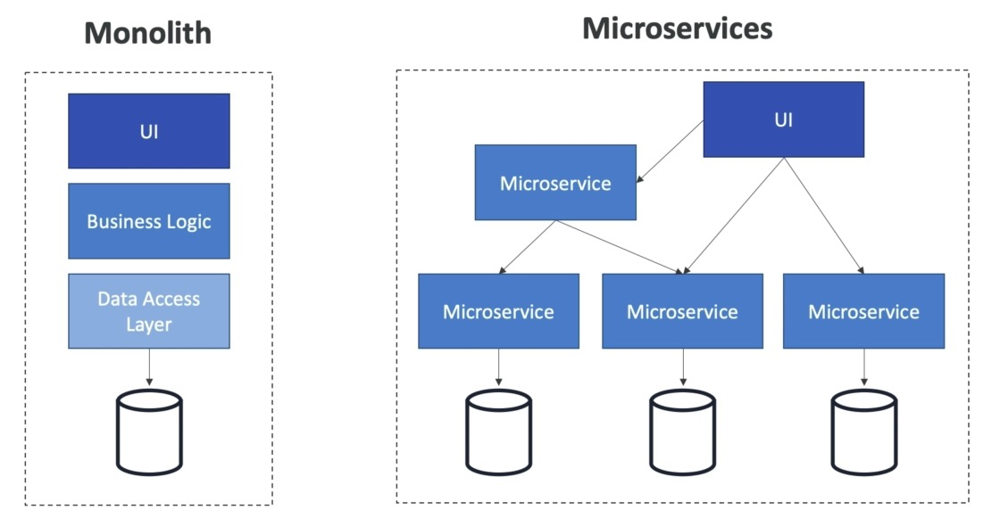

## 1 - Setup Microservice

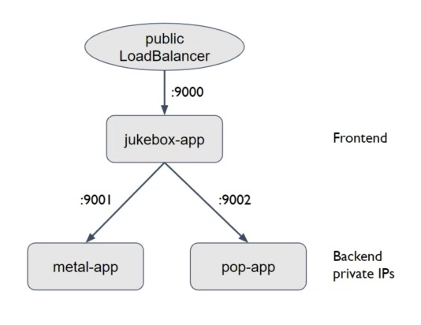

* start with _metalapp_ and _popapp_ taskdefinition

```bash
cd 1-Setup
aws ecs register-task-definition  --cli-input-json file://td-metalapp-setup.json --region eu-central-1
aws ecs register-task-definition  --cli-input-json file://td-popapp-setup.json --region eu-central-1
```

* create ECS service for both, _metalapp_ and _popapp_ both without public URL assignment and without LB
* grab URLs (host:port) of both services and set it in the td-jukebox.json taskdefinition, environment variables
* create taskdefinition for jukeboxapp (the frontend)

```bash
aws ecs register-task-definition  --cli-input-json file://td-jukebox-setup.json --region eu-central-1
```

* create jukebox service
* grab public URL of jukebox ALB Url and make some requests


## 2 - Adding tracing with AWS XRay and logging with AWS CloudWatch

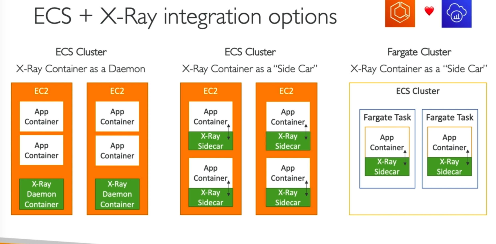

### How XRay works


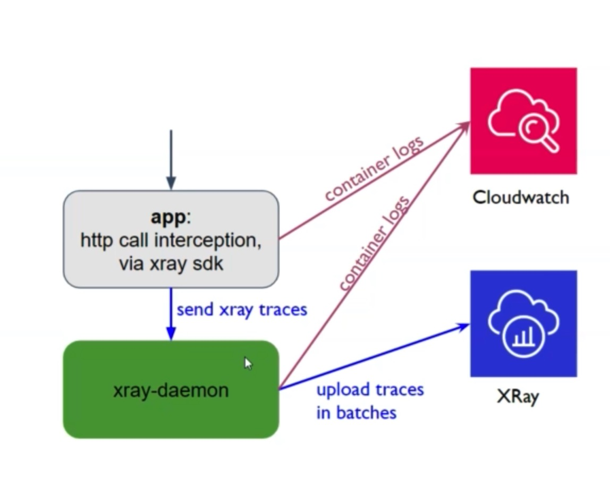

Extend role _ecsTaskRole_ by attaching policy **AWSXRayDaemonWriteAccess**

Updating the task definitions to add xray-daemon sidecar container and additional env properties.  

```bash

cd 2-Tracing-Logging

aws ecs register-task-definition  --cli-input-json file://td-metalapp-tracing.json --region eu-central-1

aws ecs register-task-definition  --cli-input-json file://td-popapp-tracing.json --region eu-central-1

aws ecs register-task-definition  --cli-input-json file://td-jukebox-tracing.json --region eu-central-1
```

Ensure to update the final IP addresses of the metal- / pop-app within the jukebox taskdefinition, section _environment variables_

To apply all the changes, redeploy the corresponding ECS service and select the latest revision of the task definition.

if set ```"networkMode": "bridge" ```,  must link the container, [example](./2-XRay-Tracing-Logging/td-jukebox-tracing.json)

```
"environment": [
          {
            "name": "AWS_XRAY_DAEMON_ADDRESS",
            "value": "xray-daemon:2000"
          },
],

 "links": [s
          "xray-daemon"
        ],
```
 

## 3 - Adding service discovery

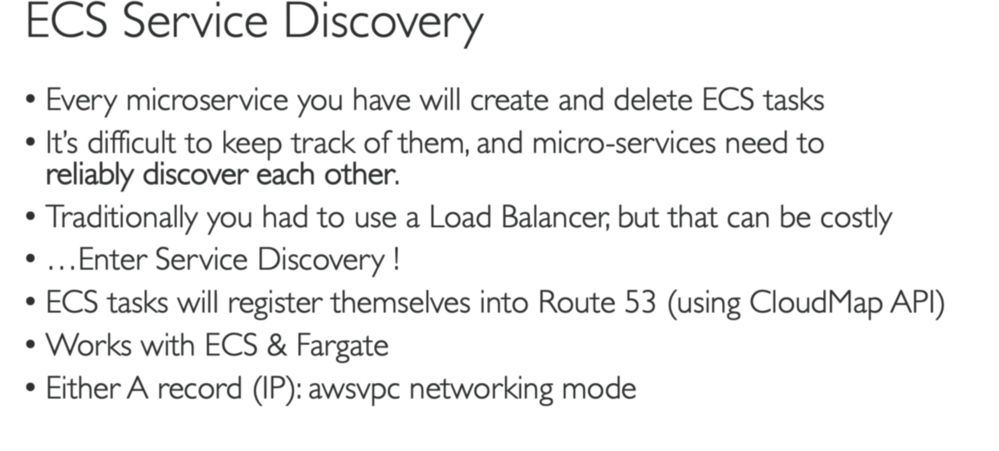

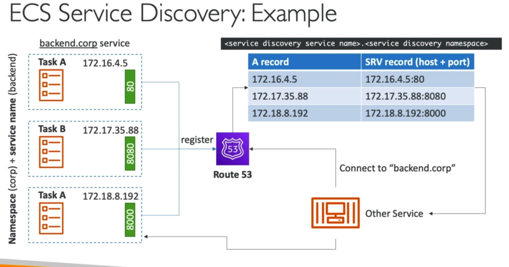

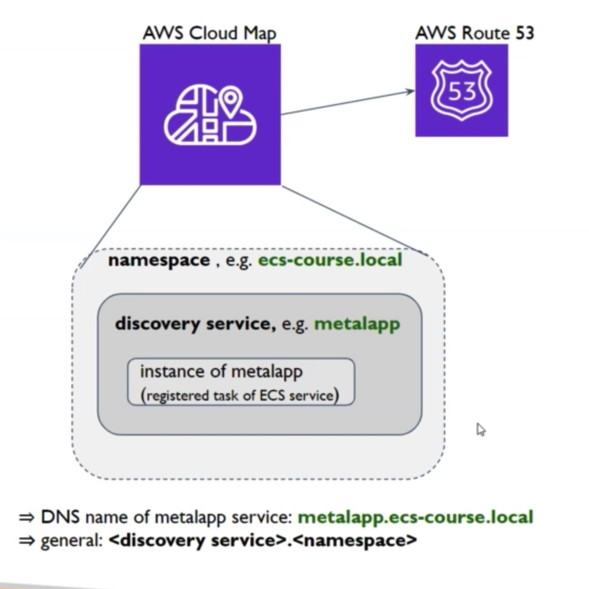

## changes to our setup

- metalapp and popapp PORT 80, instead of 9001/9002
- adjust security groups "metalsvc" and "popsvc" to allow port 80
- adjust jukebox task definition to replace the METAL_HOST and POP_HOST env variables by the DNS names of the corresponding services, metalsvc.ecs-course.local and popsvc.ecs-course.local
- apply the changed task definitions
- delete existing services for metal- , and popsvc
- recreate service for metal- , and popsvc including _service discovery_
- redeploy the jukebox service with latest revision

##  Service discovery details

- namespace: _ecs-course.local_
- service discovery services: _metalsvc_ and _popsvc_
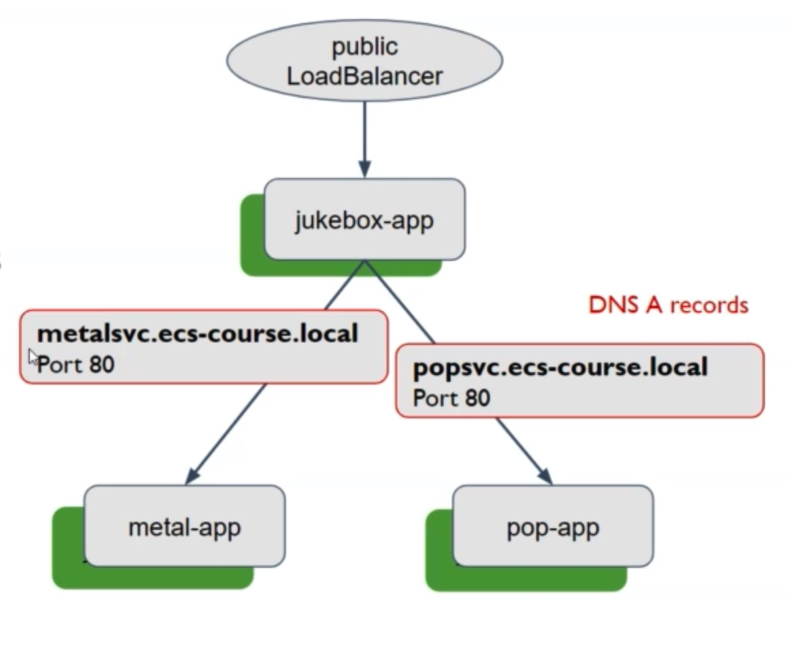

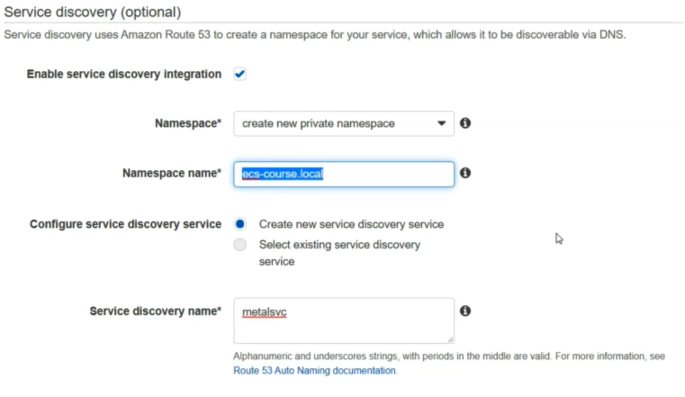

## apply task definitions

```bash
cd 3-ServiceDiscovery
aws ecs register-task-definition  --cli-input-json file://td-metalapp-servicediscovery.json --region eu-central-1

aws ecs register-task-definition  --cli-input-json file://td-popapp-servicediscovery.json --region eu-central-1

aws ecs register-task-definition  --cli-input-json file://td-jukebox-servicediscovery.json --region eu-central-1
```

## 4 - Adding AppMesh

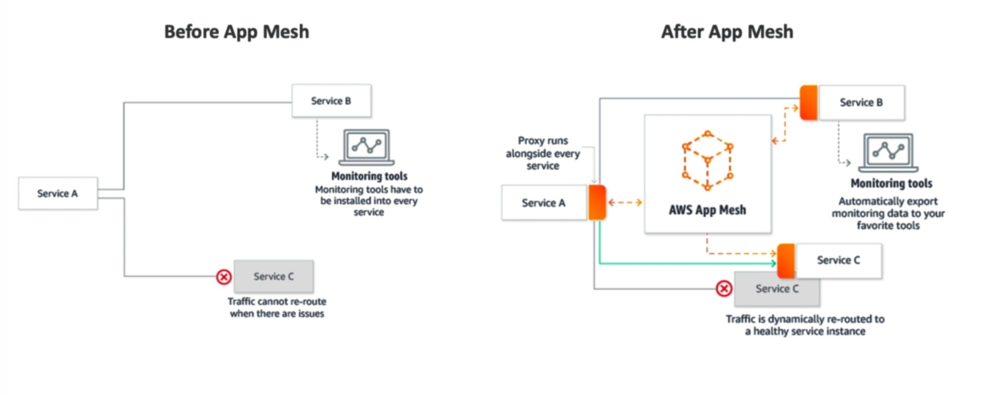

*Note: all traffic are going through Envoy proxy. No direct communinication between main services*

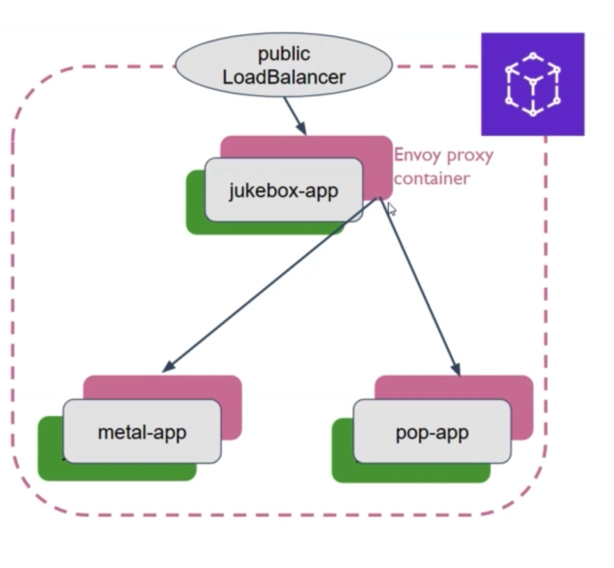

## extend TaskExecutionRole
attach policy _AWSAppMeshEnvoyAccess_

## create AppMesh resources


* open AWS mgm console, _AppMesh_ service
* click _Create Mesh_
* provide name _jukebox-mesh_ and click button _Create mesh_
* create AppMesh components

```bash
aws cloudformation create-stack --stack-name appmesh-resources --template-body file://./mesh-resources.yaml
```

## adjust ECS services

### Jukebox service

#### Taskdefinition

* change to networking mode _awsvpc_ and launchtype _FARGATE_
* ensure env variables for metal and pop hosts match their service discovery names **metal-service.ecs-course.local** and **pop-service.ecs-course.local**
* delete environment variable **AWS_XRAY_DAEMON_ADDRESS**
* delete _Links_ entry _xray-daemon_ (this is no longer required in network mode awsvpc)
* enable AppMesh integration by clicking checkbox _Enable App Mesh integration_
  * select _jukebox_ as application container name
  * select _jukebox-mesh_ as Mesh name
  * select _jukebox-service-vn_ as Virtual node name
  * **click Apply** !
  * click _Confirm_
* in Container definitions, open the _envoy_ container
  * add environment  variable _ENABLE_ENVOY_XRAY_TRACING_ with value _1_
  * enable Cloudwatch logging
* click on _Create_ to create the new task definition revision

#### ECS service


* delete existing ECS service _jukeboxsvc_
* delete listener _9000_ in ALB
* create new service
  * add to loadbalancer, new listener port _9000_, new target group _jukeboxsvc_
  * click _Enable service discovery integration_
  * select the existing namespace _ecs-course.local_
  * create new service discovery service _jukebox-service_


### Metal service

#### Taskdefinition

* move to _Fargate_ launchtype (to avoid the limitation of ENIs on our t2.small EC2 instance) by switching from _EC2_ to _Fargate_ in Requires compatibilities
* set _Task memory_ to _1GB_
* set _Task CPU_ to _0.5vCPU_
* enable AppMesh integration by clicking checkbox _Enable App Mesh integration_
  * select _metalapp_ as application container name
  * select _jukebox-mesh_ as Mesh name
  * select _metal-service-vn_ as Virtual node name
  * **click Apply** !
  * click _Confirm_
* in Container definitions, open the _envoy_ container
  * add environment  variable _ENABLE_ENVOY_XRAY_TRACING_ with value _1_
  * enable Cloudwatch logging
* click on _Create_ to create the new task definition revision

#### ECS service
* recreate ECS service
* create new security group, open port 80 from everywhere
* click _Enable service discovery integration_
  * select existing namespace
  * select existing service discovery service
  * select _metal-service_
* click _Next step_
* click _Next step_
* click _Create service_

### Pop service

#### Taskdefinition

* enable AppMesh integration by clicking checkbox _Enable App Mesh integration_
  * select _popapp_ as application container name
  * select _jukebox-mesh_ as Mesh name
  * select _pop-service-vn_ as Virtual node name
  * **click Apply** !
  * click _Confirm_
* in Container definitions, open the _envoy_ container
  * add environment  variable _ENABLE_ENVOY_XRAY_TRACING_ with value _1_
  * enable Cloudwatch logging
* click on _Create_ to create the new task definition revision


## apply task definitions

```bash
cd 4-AppMesh
aws ecs register-task-definition  --cli-input-json file://td-metalapp-appmesh.json --region eu-central-1
aws ecs register-task-definition  --cli-input-json file://td-popapp-appmesh.json --region eu-central-1
aws ecs register-task-definition  --cli-input-json file://td-jukebox-appmesh.json --region eu-central-1
```
